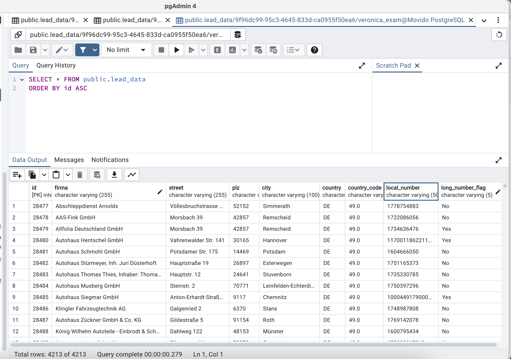

# Movido - Analysis of Lead Data

## Project Context and Objective

Movido Media Verlag GmbH is a local marketing firm offering a SaaS solution that enhances businesses' online visibility across platforms like Google Maps, Apple Maps, and various business directories. Our mission is to ensure our clients' business information is accurate and easily discoverable by potential customers. Our data-driven sales process involves processing large volumes of lead data, which needs to be cleaned, normalised, and enhanced before being fed into downstream systems. We're also tasked with developing a robust system for storing, retrieving, and tracking lead information to measure future performance.

## Data Source
The data in this Analysis with Python project includes one Excel file with multiple datasets/sheets

# Approach


### Task 1: Data Cleaning process, handling duplicates, and missing values
The cleaning phase of this task was extensive. A lot of data was missing, some data was incorrect, most of the phone numbers picked at random did not match the Company name, there were phone numbers that were too long to be actual phone numbers. 

However, as this is lead data, it was important to keep in mind not to drop or remove data that could be potential leads. 
The 'work around' or alternative, was for to flag these numbers that look 'odd' and to come back to them at a later stage instead of deleting them completely.

Check the [Jupyter Notebok](https://github.com/Veronica-MN/Veronica_DataAnalyst_Assessment/blob/main/Task1_Data_Cleaning.ipynb)

### Task 2: Database Operations, schema creation, and data insertion
This phase involved:
  - Connecting to the PostgreSQL database using psycopg2 with SSL and provided credentials
  - Designed a database schema and created the **lead_data table** with the necessary columns **(firma, street, plz, city, country, country_code, local_number)**

```sql
cursor = conn.cursor()


create_table_query = """
CREATE TABLE IF NOT EXISTS lead_data (
    id SERIAL PRIMARY KEY,
    firma VARCHAR(255),
    street VARCHAR(255),
    plz VARCHAR(10),
    city VARCHAR(100),
    country VARCHAR(5),
    country_code VARCHAR(10),
    local_number VARCHAR(50),
    long_number_flag VARCHAR(5)
);
"""

cursor.execute(create_table_query)
conn.commit()
```


  - Used to_sql() to load the cleaned and merged dataset into PostgreSQL, verifying the row count to ensure the data was correctly inserted
​
I wanted to have a look, to see what the actual table looks like in Postgresql. So i downloaded and installed **pgAdmin** to do so:




### Task 3: Data Enhancement, using APIs to retrieve missing information like phone numbers

### Task 4: Exploratory Data Analysis and Insights 


# How to Run the Code


# Dependencies 

- pandas
- numpy
- matplotlib
- SQLAlchemy
- psycopg2
- requests (for APIs)

# Report
A report on this Analysis can be found [here](https://medium.com/@veronica_v/analysis-of-lead-data-and-recommendations-d08dbe4807ca)
